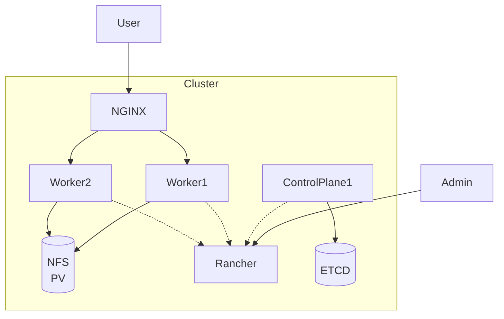

> DEPRECATED: No longer in use, as it has been replaced with [BEAVER Cluster](../beaver)

# ALPACA Cluster

Rancher-managed Kubernetes cluster using debian machines hosted at [Netcup.de](netcup.de) (for 5€ voucher you can
use `36nc16192003780` at checkout). The installation was manually done, the overall architecture:

