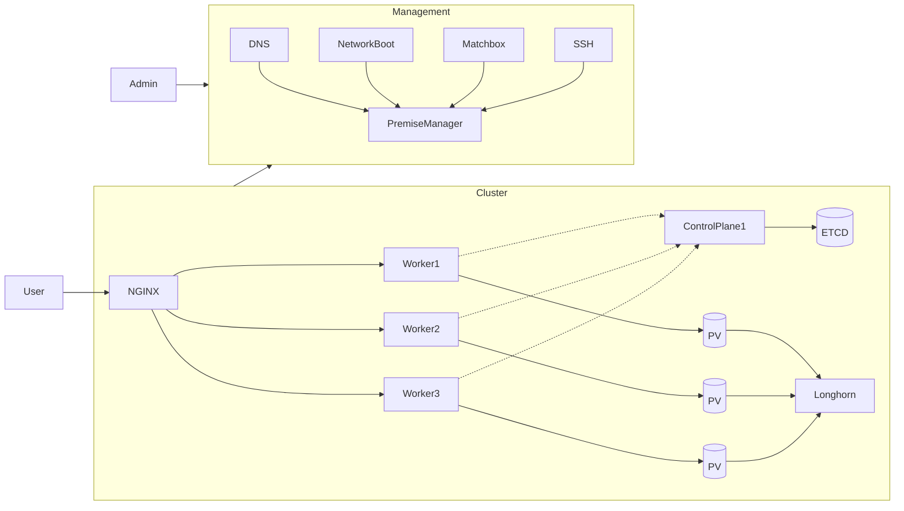

> DEPRECATED: No longer in use, as it has been replaced with [CAPYBARA Cluster](../capybara)

# BEAVER Cluster

Typhoon-managed Kubernetes cluster using coreos machines hosted at [Netcup.de](netcup.de) (for 5€ voucher you can
use `36nc16192003780` at checkout). The installation is managed through Terraform, the overall architecture:

